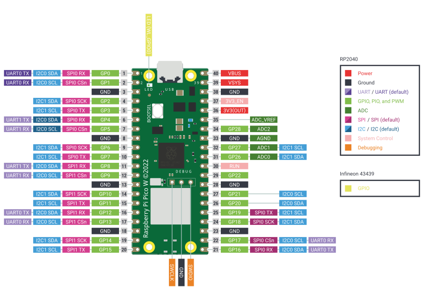

# Raspberry Pi Pico W - Manual de Referência

## 1. Introdução

O Raspberry Pi Pico W é uma placa com um microcontrolador Raspberry Pi RP2040 e conectividade Wi-Fi, Bluetooth, USB e GPIO (RASPBERRY PI FOUNDATION, 2023). Ele é projetado para ser usado em uma variedade de aplicações, desde projetos de hobby até aplicações industriais.

## 2. Características Principais

Segundo o Datasheet do Raspberry Pi Pico W (RASPBERRY PI FOUNDATION, 2023), essas são as suas principais características:

| Característica                                | Descrição                                                  |
|-----------------------------------------------|------------------------------------------------------------|
| Microcontrolador                              | RP2040                                                     |
| Memória                                       | 2MB de Flash                                               |
| Conectividade                                 | Wi-Fi de banda única de 2,4GHz (802.11n, Bluetooth 5.2)    |
| Porta                                         | Micro USB B para energia e dados                           |
| GPIOs                                         | 26 multifuncionais de 3.3v                                 |
| Interfaces de comunicação suportadas pelos GPIOs | PWM, UART, SPI e I2C                                      |
| Alimentação                                   | 1.8V a 5.5V                                                |
| Porta de depuração                            | Serial Arm de 3 pinos (SWD)                                |
| Temperatura recomendada de operação           | -20°C a 70°C                                               |

## 3. Interfaces de Comunicação

O Raspberry Pi Pico W possui vários pinos de input e output (General Purpose Input/Output ou "GPIOs") que podem ser usados para interagir com outros dispositivos e componentes.

Conformeo pinout acima, disponível no Datasheet do Raspberry Pi Pico W (RASPBERRY PI FOUNDATION, 2023), o dispositivo possui diversas interfaces de comunicação com dispositivos externos. A descrição completa segue abaixo.

### Pinos de Energia e Terra:

VBUS: Entrada de energia micro USB.
VSYS: Entrada de energia do sistema.
GND: Pinos de terra.
3V3(OUT): Saída de 3.3V.

### Pinos ADC (Analog to Digital Converter):

ADC é o conversor de sinal analógico para digital.

ADC0, ADC1, ADC2: Pinos de entrada analógica.

ADC_VREF: Saída de energia e tensão de referência do ADC.

AGND: Terra analógico.

### Pinos GPIO (General Purpose Input/Output), PIO (Programmable Input/Output) e PWM (Pulse Width Modulation):

Rotulados como GP0 a GP28.

Alguns destes pinos têm múltiplas funções, pois também são usados para comunicação SPI, I2C e UART.

#### Pinos UART (Universal Asynchronous Receiver-Transmitter):

UART é um hardware usado para comunicação serial assíncrona. O Raspberry Pi Pico W possui duas interfaces UART, UART0 e UART1.

- UART0 TX/RX
- UART1 TX/RX

#### Pinos I2C (Inter-Integrated Circuit):

I2C é um barramento serial usado para conectar dispositivos a um microcontrolador. O Raspberry Pi Pico W possui duas interfaces I2C, I2C0 e I2C1.

- I2C0 SDA/SCL
- I2C1 SDA/SCL

#### Pinos SPI (Serial Peripheral Interface):

SPI é um barramento serial com casos de uso semelhantes ao I2C. O Raspberry Pi Pico W possui duas interfaces SPI, SPI0 e SPI1.

- SPI0 CSn/SCK/TX/RX
- SPI1 CSn/SCK/TX/RX

### Interface Wireless:

O Raspberry Pico W possui o chip Infineon CYW43439, que fornece as seguintes funcionalidades:

- WiFi 4 (802.11n), Banda única (2.4 GHz)
- WPA3
- SoftAP (Até 4 clientes)
- Bluetooth 5.2

O chip Infineon é conectado ao microcontrolador RP2040 através do padrão SPI (Serial Peripheral Interface) já mencionado.

### USB:

O microcontrolador RP2400 tem um controlador USB 1.1 embutido. O Raspberry Pi Pico W possui uma porta micro USB tipo B para alimentação e comunicação com outros dispositivos, como um computador.

## 4. Prova de Conceito

Para testar o funcionamento do Raspberry Pi Pico W, foi desenvolvida uma prova de conceito que consiste em um programa que lê o valor de um potenciômetro e imprime esse valor no terminal do simulador. O programa pode ser acessado no seguinte link: https://wokwi.com/projects/379064905333117953.

O código do programa está disponível na pasta `src` deste repositório.

## 5. Referências

RASPBERRY PI FOUNDATION. Pico Wireless Datasheet. 2023. Disponível em: <https://datasheets.raspberrypi.com/picow/pico-w-datasheet.pdf>. Acesso em: 19/10/2023.
